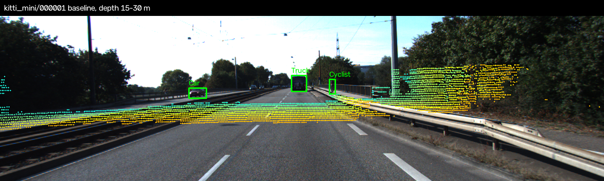
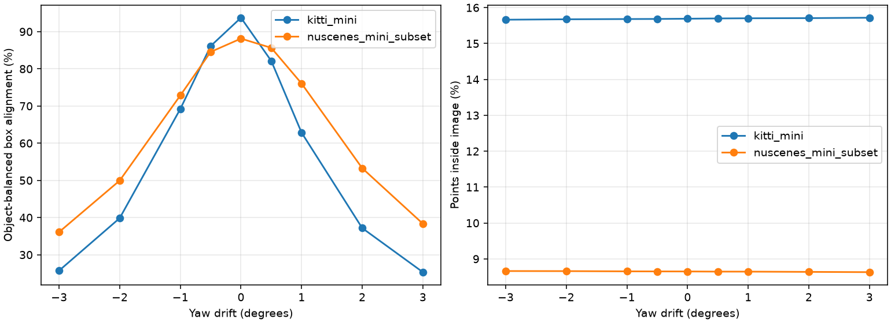
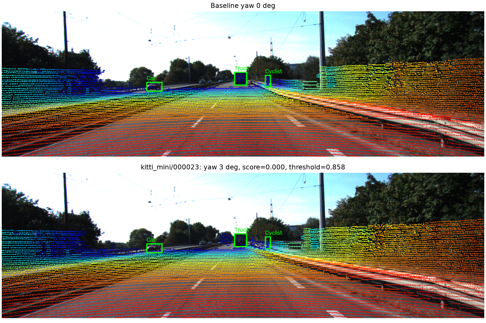
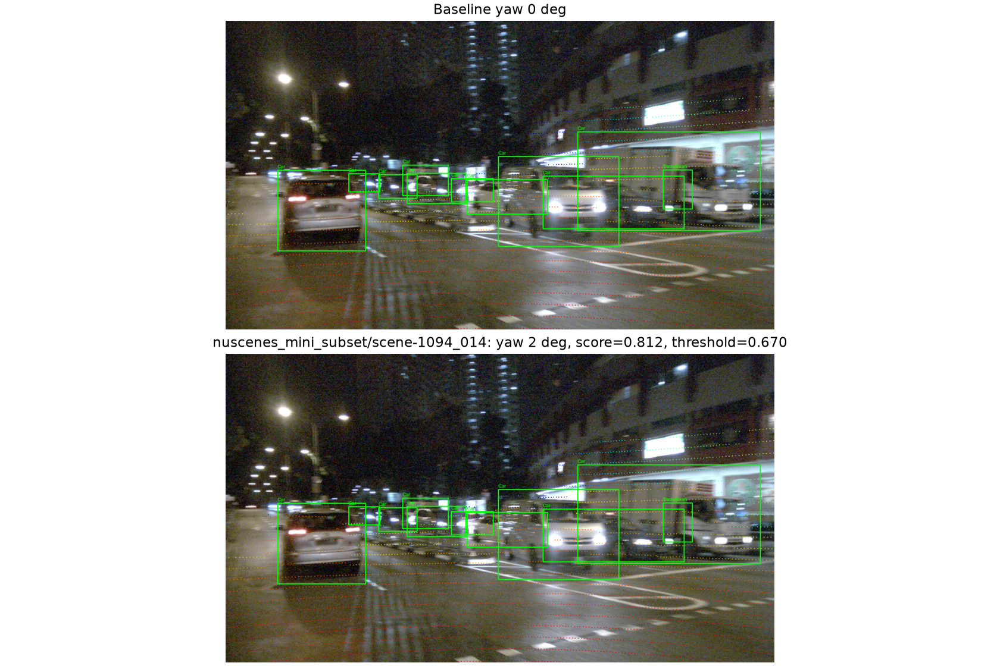

# Báo cáo Day 6: Kiểm tra calibration LiDAR–camera bằng projection

- **Họ tên:** Nguyễn Khánh Đỗ
- **MSSV:** 2A202602687
- **Lớp:** VinUni AI20K · Track 4
- **Link repo:** https://github.com/Diohus/NguyenKhanhDo-2A202602687-Track4-Day21
- **Topic:** A — LiDAR-camera projection QA
- **Dataset:** `data/synthetic`, `data/kitti_mini`, `data/nuscenes_mini_subset`
- **Các frame đã dùng:** synthetic `000000`–`000004`; cả 20 ID trong KITTI mini (`000001`–`000061`, xem `results/calibration_frames.csv`); hai scene nuScenes `scene-0103_000`–`039` và `scene-1094_000`–`039`.

## 1. Claim

Với cùng điểm LiDAR, cùng nhãn và cùng vùng 70 m, làm lệch yaw extrinsic từ 0° lên +3° làm giảm **điểm khớp box 2D** ít nhất 40 điểm phần trăm trên cả KITTI và nuScenes. Chỉ số inside-FOV riêng lẻ có thể che giấu lỗi này. Điểm khớp box giúp phát hiện drift lớn, nhưng ngưỡng cố định không đáng tin trên mọi frame.

## 2. Evidence

**Cách đo:** lọc điểm hữu hạn trong 70 m; chọn Car/Van/Truck/Bus/Pedestrian/Cyclist/Bicycle có ít nhất 5 điểm trong GT box 3D của **calibration gốc**. Với mỗi object, `score = số điểm gốc chiếu vào 2D box / số điểm gốc trong 3D box`; trung bình các object rồi các frame. Giữ nguyên point/object set khi xoay yaw −3° đến +3° (9 mức), hoặc dịch trục z LiDAR 0–10 cm (4 mức). Seed 21 chỉ tác động stress test. `inside-FOV = điểm hữu hạn trong vùng có pixel nằm trong ảnh / tổng điểm hữu hạn trong vùng`. Box KITTI lấy từ label gốc; box nuScenes được `starter/nuscenes_io.py` chiếu từ annotation 3D, nên phép đánh giá nuScenes không hoàn toàn độc lập với hình học 3D.

| Dataset | Yaw 0° | Yaw +1° | Yaw +3° | Inside-FOV 0° → +3° | Object đủ điểm |
|---|---:|---:|---:|---:|---:|
| KITTI mini, 20 frame | 93.74% | 62.83% | 25.32% | 15.69% → 15.72% | 110 |
| nuScenes mini, 80 frame | 88.14% | 76.05% | 38.35% | 8.65% → 8.63% | 461 |

Suy giảm tương ứng **68.42** và **49.79** điểm phần trăm, xác nhận claim. Ở +3°, dịch chuyển pixel trung vị của cùng điểm trong FOV là **43.61 px** (KITTI) và **75.26 px** (nuScenes). Dịch z 10 cm chỉ làm score KITTI từ 93.74% xuống 92.74%, nuScenes từ 88.14% xuống 87.72%: cùng mức thay đổi, yaw gây ảnh hưởng mạnh hơn theo score này. Trong KITTI, nhóm >30 m giảm từ **99.68% xuống 12.71%** ở +3° (37 object); nhóm 0–15 m từ **78.96% xuống 55.23%** (32 object). Khác biệt giữa hai bộ dữ liệu còn do 64 so với 32 beam, ảnh 1242×375 so với 1600×900, scene ngày/đêm, cách tạo nhãn 2D và lệch timestamp LiDAR–camera nuScenes trung bình **−35.62 ms** đã được bù ego motion; vì vậy không thể quy mọi chênh lệch cho một nguyên nhân.




Dữ liệu gốc và từng frame: [`calibration_summary.csv`](../results/calibration_summary.csv), [`calibration_frames.csv`](../results/calibration_frames.csv), [`calibration_objects.csv`](../results/calibration_objects.csv), [`calibration_distance_summary.csv`](../results/calibration_distance_summary.csv). Overlay theo 3 khoảng cách `0–15`, `15–30`, `30–70` m cho từng dataset nằm trong `results/figures/demo_*.png`. Nguồn ảnh thật: KITTI Vision Benchmark Suite và nuScenes (Motional).

**Advanced — ngưỡng phát hiện:** lấy mỗi frame thứ 5 làm tập hiệu chỉnh, chỉ dùng yaw 0°: `threshold = max(0, phân vị 5% score − 0.05)`, gắn cờ nếu score thấp hơn threshold. Trên tập đánh giá tách riêng, threshold KITTI **0.858** gắn cờ 16/16 frame ở +3° nhưng báo sai 5/16 frame ở 0°; threshold nuScenes **0.670** gắn cờ 64/64 ở +3°, báo sai 2/64 ở 0°, và chỉ 49/64 ở +2°. Đây là kiểm tra minh họa trên tập nhỏ, chưa đủ để đưa ngưỡng cố định vào xe thật. Xem [`drift_detection.csv`](../results/drift_detection.csv) và [plot](../results/figures/drift_detection.png).

**Bonus B1–B5:** so sánh hai cấu hình projection `float64` và `float32` trên cùng frame/metric: KITTI p50 **15.46/12.63 ms**, nuScenes **2.43/2.60 ms** theo thứ tự 64/32 bit; 32 bit nhanh hơn trên KITTI nhưng không trên nuScenes, sai khác pixel tối đa <0.00018 px và mask không đổi. Số đo gồm 30 lượt sau warm-up, chỉ tính phép chiếu, chạy trên CPU Intel Core i5-11400H, Python 3.13, NumPy 2.1.2, không dùng GPU; p95 và từng lượt ở [`latency_summary.csv`](../results/latency_summary.csv), [`latency.csv`](../results/latency.csv). Latency phụ thuộc máy/tải nền, không yêu cầu chạy lại ra đúng mili giây. Stress test dropout giữ 100/90/70/50/30% điểm và Gaussian noise σ=0/0.02/0.05/0.1/0.2 m; cùng seed 21 và cùng mẫu random theo mức, metric chia cho số điểm object **trước** dropout. Ví dụ KITTI dropout 30% còn 29.13% alignment gốc, noise 0.2 m còn 84.33%; nuScenes tương ứng 26.22% và 81.18%. Xem [`stress_summary.csv`](../results/stress_summary.csv), [plot](../results/figures/stress_test.png). Script có `--help`, tham số dataset/frame/seed/mức yaw/range và tự kiểm geometry, dùng lại được ở lab sau.

**Bonus B6 — kiểm tra lỗi cài sẵn synthetic:**

| Lỗi | Frame | Cách phát hiện |
|---|---|---|
| Điểm có NaN | `000000`–`000004` | 22–23 điểm/frame có tọa độ hoặc intensity không hữu hạn; `invalid_ratio` ≈0.096–0.100%; phải lọc trước projection. |
| Mất điểm theo sector | `000003` | Các bin azimuth −40° đến −5° chỉ còn 29.05% mật độ tham chiếu leave-one-out; frame giảm còn 22,063 điểm. |
| Khoảng thời gian bất thường | `000003` | Từ timestamp 0.2 lên 0.4 s là gap 0.2 s, gấp đôi gap thường 0.1 s. |

Bảng tự động: [`synthetic_audit.csv`](../results/synthetic_audit.csv), [biểu đồ](../results/figures/synthetic_audit.png). Các frame đều có ít điểm NaN, nên đây là một lỗi lặp trên năm frame. Quan sát này không chứng minh dữ liệu không còn lỗi khác.

## 3. Failure case



Trên KITTI frame `000023`, khi yaw +3°, score = **0.000** so với threshold 0.858; điểm LiDAR lệch khỏi các 2D box dù số điểm inside-FOV thay đổi rất ít. Lỗi ở lớp **Geometry**: ma trận extrinsic đã bị xoay quanh z LiDAR, tạo dịch chuyển ngang tăng theo khoảng cách. Khi triển khai, theo dõi score theo từng khoảng cách/object, kiểm tra transform và tái calibration khi bất thường; chỉ đếm điểm trong FOV không đủ.



Trên nuScenes `scene-1094_014`, yaw +2° dịch điểm trung vị **50.86 px**, nhưng score **0.812** vẫn trên threshold **0.670**, nên **bị bỏ sót**. Lỗi ở lớp **Metric**: box rộng/chồng lấn và trung bình theo object vẫn nhận điểm dù overlay lệch. Bổ sung kiểm tra edge alignment, tách score theo khoảng cách/kích thước box và giám sát biến động theo thời gian; cần đánh giá false alarm bằng dữ liệu độc lập trước khi dùng ngưỡng. Danh sách case và số liệu ở [`failure_cases.csv`](../results/failure_cases.csv).

## 4. Khuyến nghị nếu triển khai thật

Trong ADAS, chạy kiểm tra calibration ngoài luồng ở vài Hz trên object tĩnh và xa; cảnh báo khi score giảm liên tục, thay vì chặn trực tiếp chức năng lái chỉ từ một frame. Ghi log `frame_id`, cặp timestamp, số điểm hợp lệ, points/object, score theo khoảng cách, số frame liên tiếp vượt ngưỡng, độ trễ p50/p95 và mã calibration. Đổi lại, kiểm tra nhiều điểm/box tăng CPU và độ trễ, còn giảm số điểm tăng rủi ro bỏ sót drift. Khi score bất thường, so chéo edge ảnh, ego motion và phép biến đổi; đưa hệ thống về trạng thái an toàn nếu kiểm tra không đạt theo quy trình ADAS. Ngưỡng trong bài chỉ được hiệu chỉnh trên 4 frame KITTI và 16 frame nuScenes, còn false alarm cao; cần thêm nhiều scene/weather và ground truth calibration trước khi dùng thực tế.

## 5. Cách chạy lại

Từ gốc repo, Python >=3.10, cài `pip install -r requirements.txt`. Môi trường dùng để tạo số liệu: Windows, Python 3.13, NumPy 2.1.2, OpenCV 4.10.0, CPU i5-11400H. Các lệnh sau tái tạo toàn bộ CSV/ảnh; phép chiếu và metric xác định lại cùng số, latency dao động theo tải máy.

```bash
python tools/verify_data.py --data-root data/kitti_mini
python tools/verify_data.py --data-root data/nuscenes_mini_subset
python -m starter.data_health --data-root data/synthetic
python -m src.calibration_qa --self-check
python -m starter.projection --data-root data/synthetic --frame 000000
python -m starter.projection --data-root data/kitti_mini --frame 000011
python -m starter.projection --data-root data/nuscenes_mini_subset --frame scene-0103_010
python -m src.calibration_qa
python tools/check_submission.py
```

Chạy `python -m src.calibration_qa --help` để xem tham số CLI. Lệnh benchmark mặc định dùng toàn bộ 20 frame KITTI, 80 frame nuScenes, seed 21, yaw `−3,−2,−1,−0.5,0,0.5,1,2,3` độ, giới hạn 70 m, object tối thiểu 5 điểm, 30 lượt latency sau warm-up. Lưu ý các ảnh failure được chọn từ kết quả đo tự động; nguồn ảnh trong `data/` giữ nguyên.

## 6. Khai báo sử dụng AI

| Công cụ | Dùng cho việc gì | Đã kiểm chứng thế nào |
|---|---|---|
| OpenAI Codex | Đọc đề/rubric, hỗ trợ viết hai hàm CP2, script benchmark, biểu đồ, phân tích và trình bày báo cáo. | Chạy kiểm tra tọa độ `(10,0,0)` ra `z=9.727321 m`, `(u,v)=(613.964,175.007)`; kiểm thêm NaN/Inf, điểm sau camera, biên FOV, rectification và box xoay; chạy trên 100 frame thật; đối chiếu CSV và xem ảnh failure. |

Người nộp cần tự hiểu công thức, cách giữ nguyên object set, phép tính score, cách đặt ngưỡng và giới hạn của nhãn nuScenes trước vấn đáp. Không dùng AI tạo số liệu hay ảnh giả; toàn bộ kết quả do script trong repo tạo từ dữ liệu đề bài.